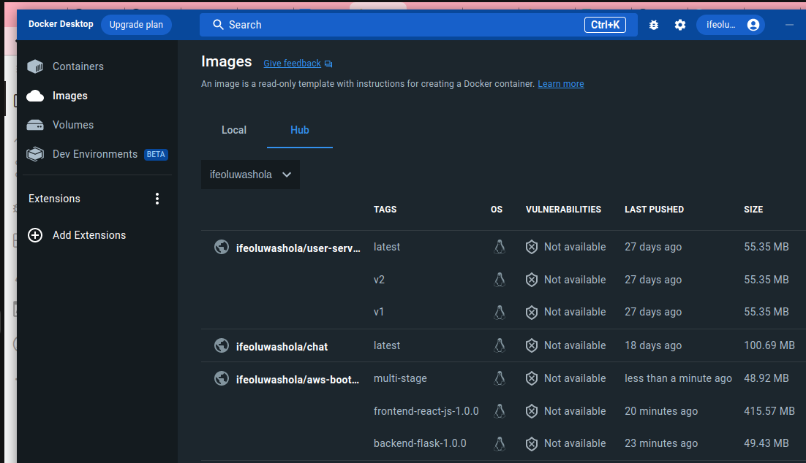

# Week 1 — App Containerization
## Homework Challenges
### Run the dockerfile CMD as an external script
I run the npm install command and here is the output:
``` 
gitpod /workspace/aws-bootcamp-cruddur-2023/frontend-react-js (main) $ npm install

up to date, audited 1472 packages in 3s

225 packages are looking for funding
  run `npm fund` for details

8 high severity vulnerabilities

To address issues that do not require attention, run:
  npm audit fix

To address all issues (including breaking changes), run:
  npm audit fix --force

Run `npm audit` for details.
```
I also run a couple of other commands too as an external script
### Push and tag a image to DockerHub (they have a free tier)
I already have a DockerHub account with some images in it, so all what I did was that I created new repository, tagged the frontend and the backend images and pushed it to the repository.
I also have Docker Desketop on my laptop so I logged in to my dockerhub account from the Docker Desktop and took a screenshot of the images I have on my account:<br>

